## UAS Pemograman Web

### Project: Sistem Checklist Kebersihan Toilet

<table>
  <thead>
    <tr>
      <th>Nama Anggota</th>
      <th>NIM</th>
      <th>Kelas</th>
      <th>GitHub</th>
    </tr>
  </thead>
  <tbody>
    <tr>
      <td>Rafif Isdarufa Athallah</td>
      <td>312210299</td>
      <td>TI.22.A3</td>
      <td><a href="https://github.com/zangetsuuuu/" target="_blank">@zangetsuuuu</a></td>
    </tr>
    <tr>
      <td>Galva Al-Ghozali</td>
      <td>312210356</td>
      <td>TI.22.A3</td>
      <td><a href="https://github.com/galvaal/" target="_blank">@galvaal</a></td>
    </tr>
    <tr>
      <td>Muhammad Syahdan Junus</td>
      <td>312210285</td>
      <td>TI.22.A3</td>
      <td><a href="https://github.com/syahdann/" target="_blank">@syahdann</a></td>
    </tr>
  </tbody>
</table>

---

### Dokumentasi

- #### Youtube

  > 

- #### Pdf

  > 

- #### Program

  > 

---

### Halaman Login

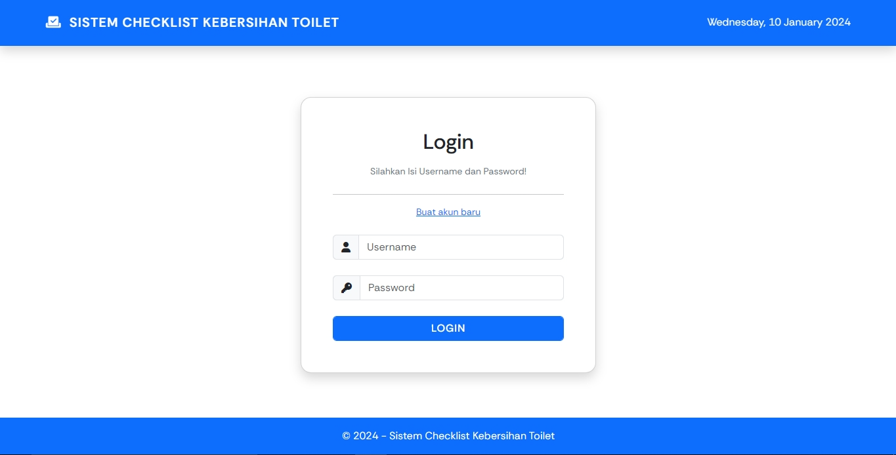

### Halaman Tambah Akun

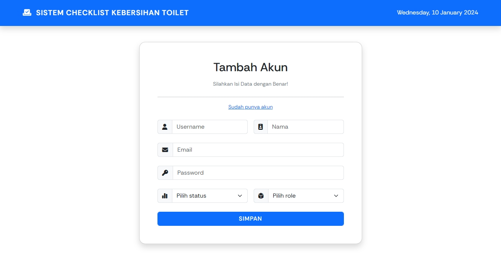

### Halaman Home

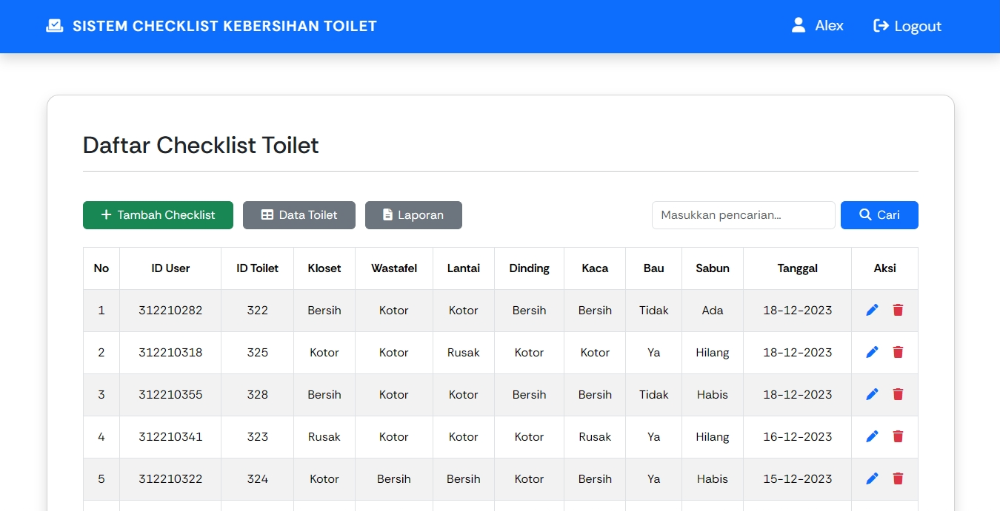

### Menu Tambah Checklist

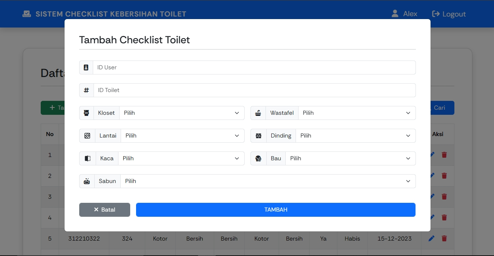

### Menu Ubah Data Checklist

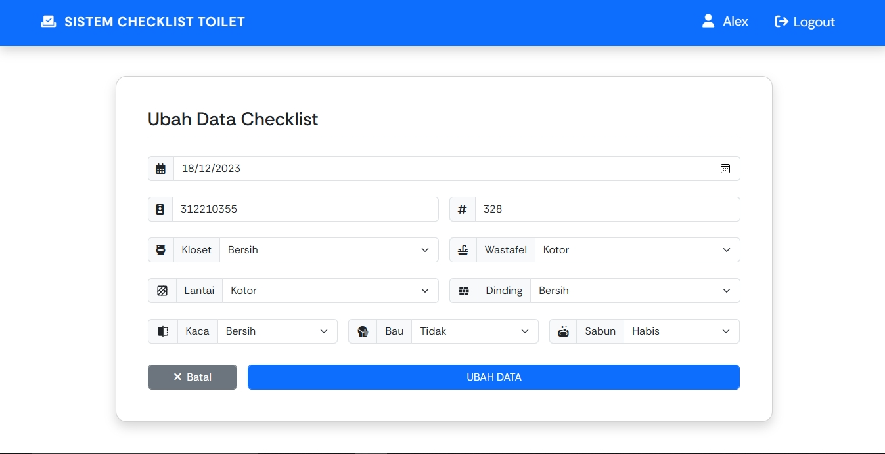

### Menu Cari Data Checklist

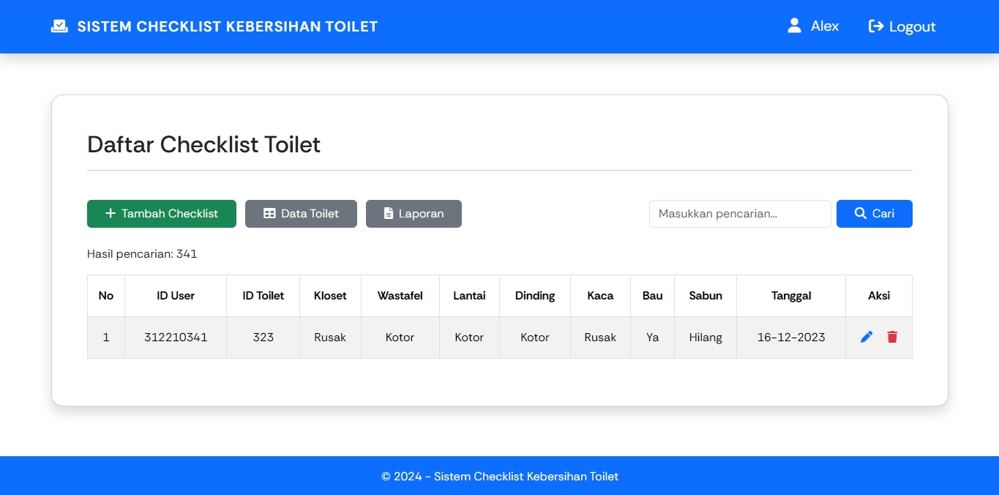

### Menu Laporan Checklist

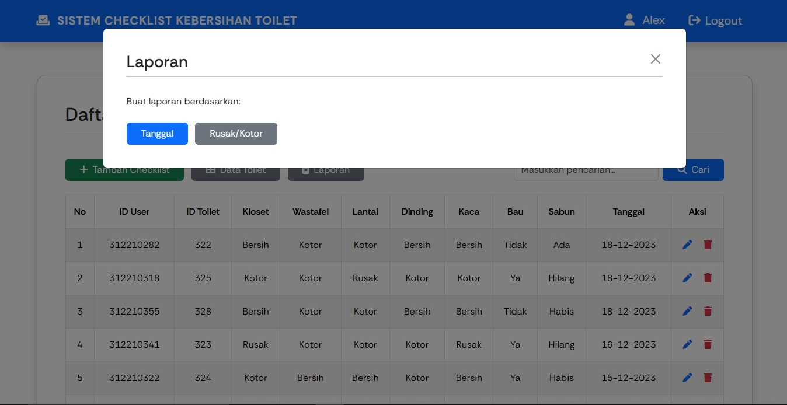

### Halaman Data Toilet

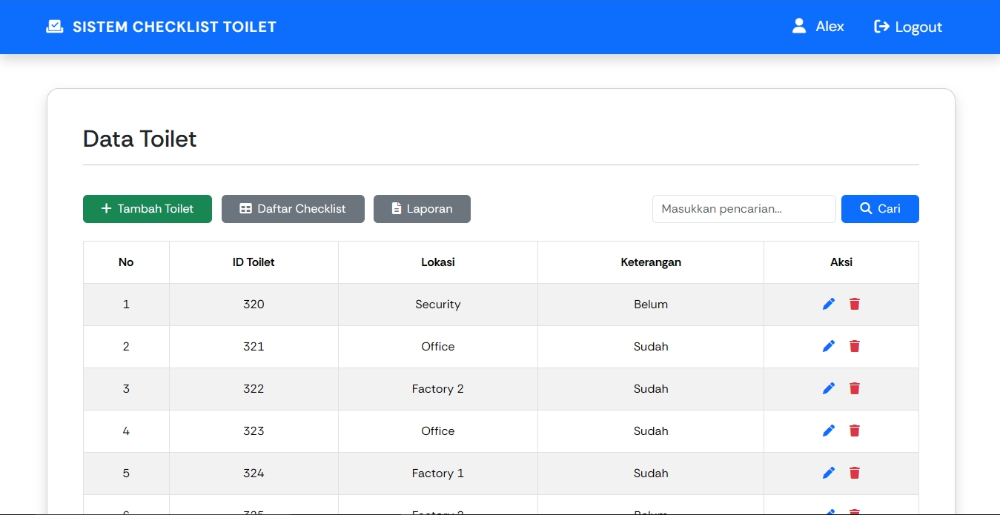

### Menu Tambah Toilet

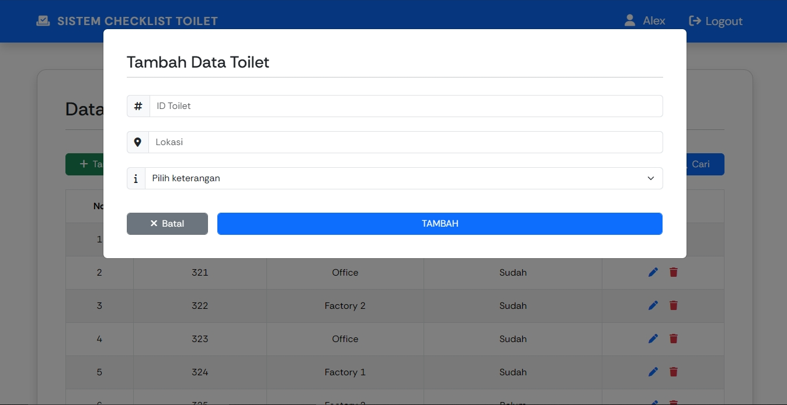

### Menu Ubah Data Toilet

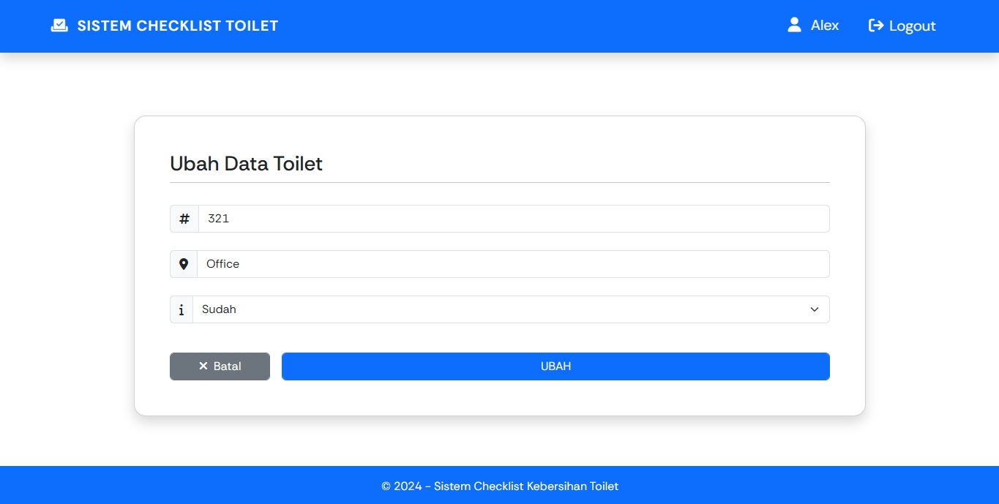

### Menu Cari Data Toilet

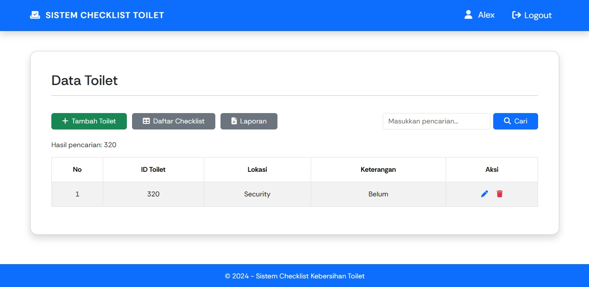

### Menu Laporan Toilet

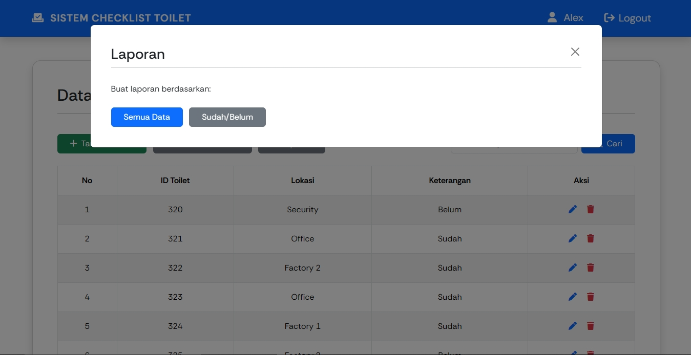

### Menu Logout

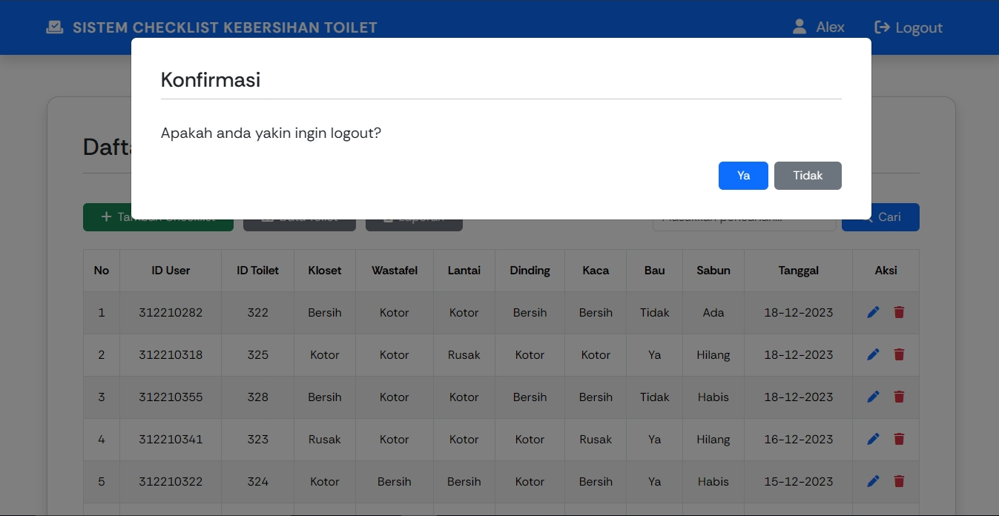

---

### Sekian, terimakasih.